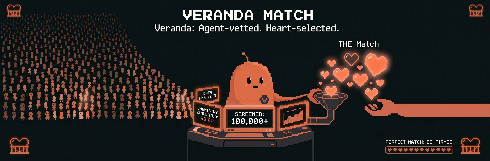

# Veranda

<p align="center">
  
</p>

<p align="center">
  <strong>Match through your agent. Reveal on your terms.</strong><br />
  <em>Agent-vetted. Heart-selected.</em>
</p>

<p align="center">
  <a href="./LICENSE"></a>
  
  
  
</p>

---

## About

Veranda is a **privacy-oriented matchmaking stack** on **Solana**. Each person is represented by an **AI agent** that moves through a candidate pool; compatibility is scored from **scenario-based** signals, shortlists narrow across rounds, and **identity is revealed only when the user chooses** (on-chain disclosure / fee model in the product design).

## Features

- **Agent-vetted** — Guided flows collect preferences and behavior signals; the agent represents you in the pool.
- **Heart-selected** — You choose from a shortlist; optional romance-style simulation before paying to disclose.
- **Privacy-first** — ZK / compressed-account direction in the architecture docs; escrow and x402-style micropayments in the codebase.
- **Solana-native** — Anchor programs (`veranda-escrow`, `veranda-rollup`), devnet-friendly demo, Privy wallet login, LI.FI for cross-chain USDC into Solana.

## Tech stack

| Layer | Stack |
| ----- | ----- |
| Frontend | Next.js 14 (App Router), Privy, LI.FI widget, pixel UI |
| Backend | Rust, Axum — matching orchestration, x402 middleware, Privy session |
| On-chain | Anchor — `veranda-escrow`, `veranda-rollup` (MagicBlock-style ER path) |
| Proofs | Circom (Groth16) in `circuits/` |

High-level flow: **Next.js** ↔ **Axum** ↔ **Solana devnet** (escrow + rollup batching). See [Architecture](./docs/ARCHITECTURE.md) for diagrams and data flow.

## Getting started

### Prerequisites

- Rust (`rustup`) and Cargo  
- Solana CLI and Anchor (see `Anchor.toml` for versions)  
- Node ≥ 18 and pnpm 9+  
- Docker (Postgres in local dev, if using compose / `just`)  
- `just` (optional; `just dev` for the full stack)

### Install and run

```bash
pnpm install
cargo fetch
cp .env.example .env
# Set DATABASE_URL, PRIVY_* / NEXT_PUBLIC_PRIVY_APP_ID, OPENAI_API_KEY (optional), etc.

just dev
```

Frontend only:

```bash
pnpm dev:frontend
# http://localhost:3000
```

### MagicBlock (Ephemeral Rollup RPC)

Matching sends `record_match` through **MagicBlock’s Solana-compatible JSON-RPC** (`MAGICBLOCK_RPC_URL`, default `https://devnet.magicblock.app`). See [MagicBlock RPC introduction](https://docs.magicblock.gg/api-reference/rpc-api/introduction).

- Health: `GET http://localhost:8080/api/v1/magicblock/health` — returns `latest_blockhash` when the RPC is reachable.
- Deploy [`veranda-rollup`](./programs/veranda-rollup/) to the ER, fund `PLATFORM_AUTHORITY_KEYPAIR` on that cluster, and keep `MAGICBLOCK_SEND=true` (set `false` to skip `sendTransaction` during local dev).

### Deploy / demo (when ready)

```bash
just deploy-devnet
just demo
```

## Project structure

| Path | Description |
| ---- | ----------- |
| [`programs/veranda-escrow/`](./programs/veranda-escrow/) | Anchor — user PDAs, escrow vaults, batch commits |
| [`programs/veranda-rollup/`](./programs/veranda-rollup/) | ER program — high-frequency `record_match` path |
| [`circuits/`](./circuits/) | Circom — membership & compatibility circuits |
| [`backend/`](./backend/) | Axum HTTP server, matching, x402, Privy session |
| [`frontend/`](./frontend/) | Next.js app — onboarding, candidates, deposit |
| [`ros-sim/`](./ros-sim/) | Optional Gazebo / ROS 2 ceremony demo |
| [`scripts/`](./scripts/) | Devnet deploy, demo runner, seed helpers |
| [`tests/`](./tests/) | Anchor + integration tests |
| [`docs/`](./docs/) | Architecture, ZK design, demo script, **banner** (`docs/assets/repo-banner.png`) |

## Documentation

| Doc | Topic |
| --- | ----- |
| [Architecture](./docs/ARCHITECTURE.md) | System design and data flow |
| [ZK design](./docs/ZK_DESIGN.md) | Proof / commitment direction |
| [Demo](./docs/DEMO.md) | Happy-path walkthrough |
| [MagicBlock RPC](https://docs.magicblock.gg/api-reference/rpc-api/introduction) | Ephemeral rollup JSON-RPC (same methods as Solana) |

## Product pricing (model)

| Action | Notes |
| ------ | ----- |
| Initial deposit | Tiered minimum; escrow / agent funding |
| Per agent-to-agent match | ~$0.01 USDC — x402 treasury (`X402_TREASURY_WALLET`) |
| Per candidate disclosure | ~$2.00 USDC — reveal identity / profile |

## Contributing

Before opening a PR, please ensure:

- `cargo check --workspace` passes  
- `anchor build` succeeds  
- `pnpm --filter frontend build` succeeds  
- `scripts/run_demo.sh` completes the documented happy path (when wired)

## License

[Apache-2.0](./LICENSE)
